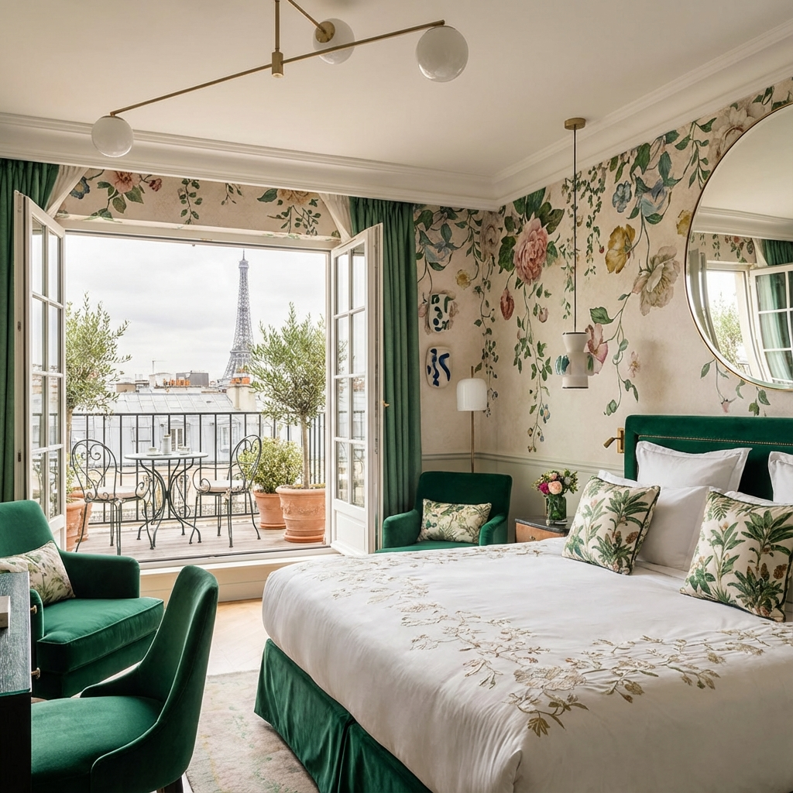
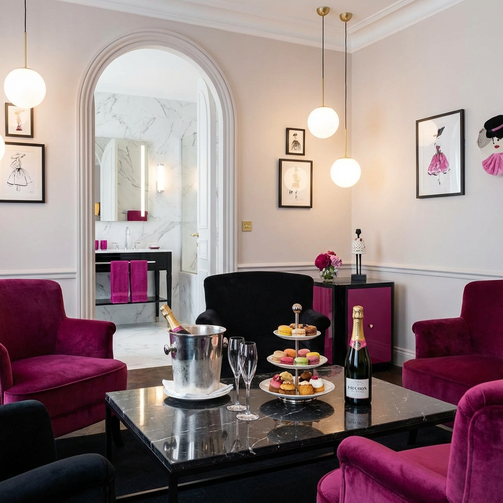
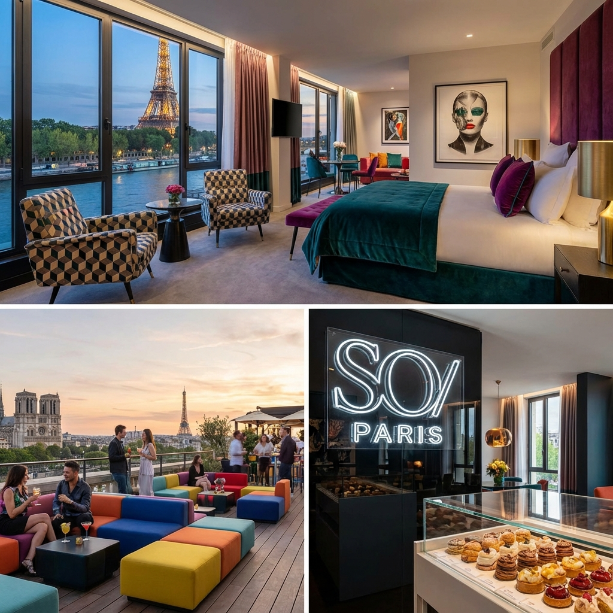
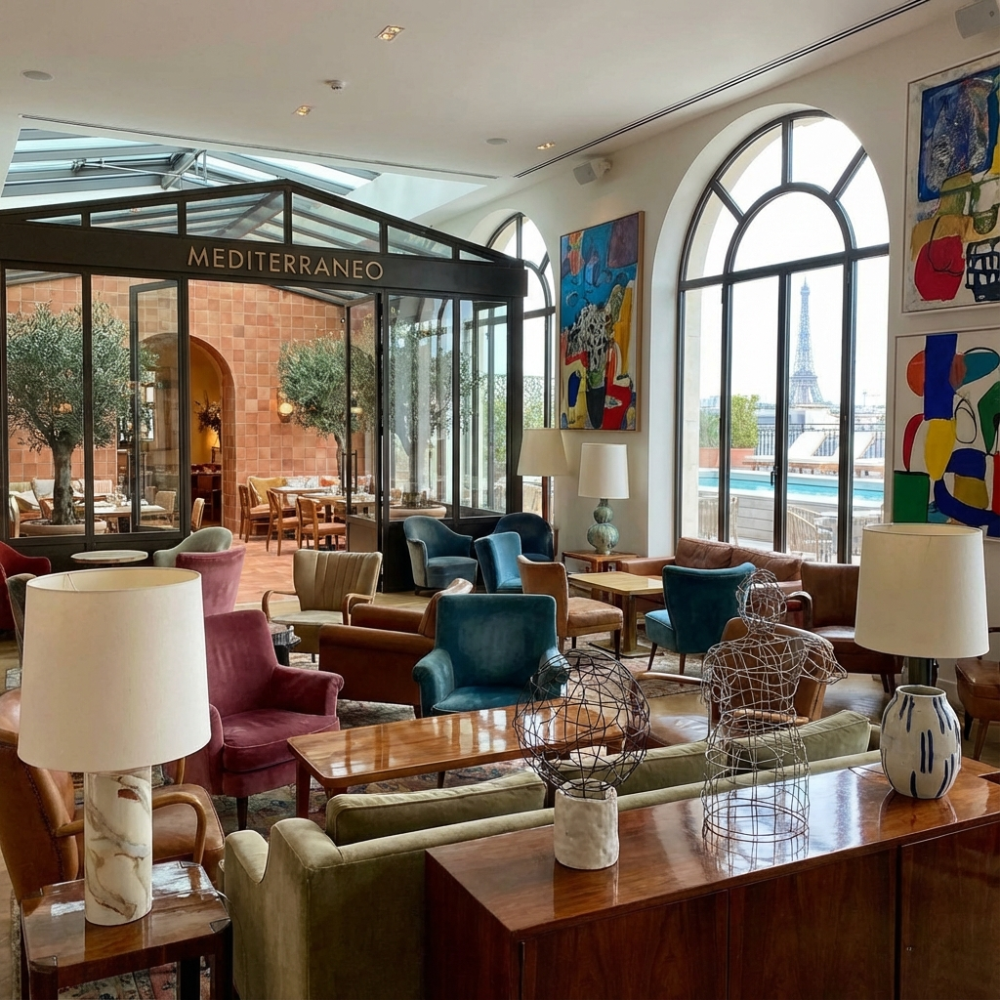
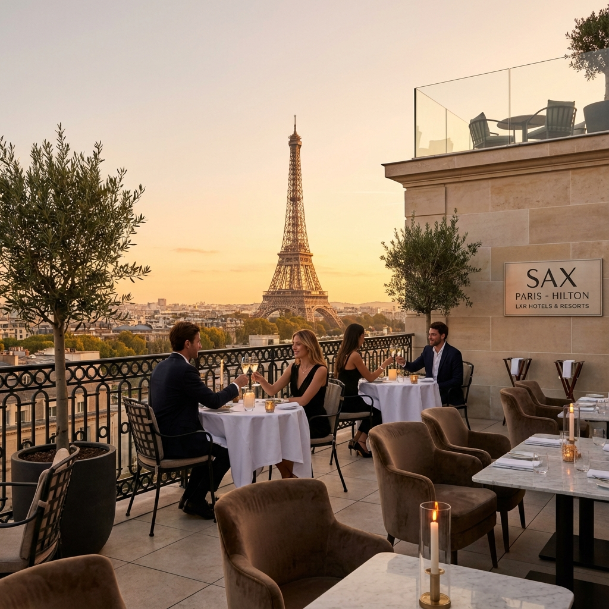

# Paris (Days 1–5)
[← Back to Itinerary](README.md)

## 🗓 July 20–24

Arrive Monday morning after the red-eye. Five days of art, food, and romance.

## 🏨 AMEX Fine Hotels + Resorts Options
*Prices shown for 4-night stay (July 28–Aug 1 search)*

**$600 hotel credit available** with Platinum Card. All include $100 property credit, room upgrade (subject to availability), daily breakfast for 2, and late checkout.

[📍 View All Hotels on Google Maps](https://www.google.com/maps/dir/La+Fantaisie+Paris/SO+Paris+Hotel/Fauchon+L'Hotel+Paris/Brach+Paris/Sax+Paris+LXR+Hotels+Resorts)

---

### 1. 🌿 La Fantaisie ⭐ BEST VALUE
**$532/night** ($2,451 total) | TripAdvisor 4.8/5 | 9th arr

**Location:** Rue Cadet – near Montmartre, not touristy, walkable to Galeries Lafayette, Opera, Louvre
**Vibe:** Whimsical floral design, opened June 2023, "lush oasis"
**Highlights:** Rooftop bar with amazing views, spa (pools + sauna), well-designed rooms

**Reddit Says:** *"Had clients stay here for their honeymoon and loved it"* • Great for couples, vibrant green terrace, rooms may be small but thoughtfully designed

---

### 2. 🍫 Fauchon L'Hotel Paris ⭐ BEST FOR FOODIES
**$650/night** ($2,969 total) | TripAdvisor 4.9/5 | 8th arr

**Location:** Near Madeleine – walk to Place de la Concorde, Rue du Faubourg Saint-Honoré boutiques
**Vibe:** Gourmet-luxury, magenta/black design, champagne & macarons at check-in
**Highlights:** Complimentary Fauchon gourmet bar in room, Le Grand Café restaurant, spa + gym

**Reddit Says:** *"Fantastic stay – champagne and macaroons at check-in, amazing service, fun whimsical design"* • In-room treats (macarons, madeleines, chocolate, foie gras)

---

### 3. 🎨 SO/ Paris Hotel ⭐ BEST VIEWS
**$545/night** ($2,510 total) | TripAdvisor 4.4/5 | 4th arr

**Location:** Bas Marais on the Seine – near metro, panoramic views of Seine, Eiffel Tower, Notre-Dame
**Vibe:** Fashion-forward, colorful design, Accor lifestyle brand
**Highlights:** Bonnie rooftop bar/restaurant with city views, spa, pool access

**Reddit Says:** *"Central location on the Seine, rooms and rooftop bar have excellent city views"* • Some noted communication issues with hotel; area is quieter stretch of Marais

---

### 4. 🎭 Brach Paris ⭐ BEST DESIGN
**$695/night** ($3,169 total) | TripAdvisor 4.1/5 | 16th arr

**Location:** 16th arr – 15-min walk to Eiffel Tower, near Fondation Louis Vuitton, Bois de Boulogne
**Vibe:** Philippe Starck design, eclectic art, converted 1970s post office
**Highlights:** 22m pool, spa, hammam, rooftop garden with Eiffel views, Mediterranean restaurant

**Reddit Says:** *"Seriously cool 5-star design hotel"* • Great for exploring a quieter, upmarket Paris; some top-floor suites have hot tubs + Eiffel views

---

### 5. 🗼 Sax Paris LXR Hotels ⭐ BEST EIFFEL VIEWS
**$697/night** ($3,175 total) | TripAdvisor 4.5/5 | 7th arr

**Location:** 7th arr near Avenue de Saxe – close to Eiffel Tower but away from chaos
**Vibe:** New Hilton luxury brand, modern interiors, rooftop with views
**Highlights:** Best Eiffel Tower views of any Hilton in Paris, spacious rooms, near riverside walks

**Reddit Says:** *"Top 3 in every category among Paris Hiltons"* • New property, rooms are "pretty luxurious," but mixed reviews on breakfast quality

---

### 💡 Quick Comparison

| Hotel | Price/Night | Total | Arr. | Best For |
|-------|------------|-------|------|----------|
| **La Fantaisie** | $532 | $2,451 | 9th | Value + Honeymoon |
| **SO/ Paris** | $545 | $2,510 | 4th | Seine Views |
| **Fauchon** | $650 | $2,969 | 8th | Foodies |
| **Brach Paris** | $695 | $3,169 | 16th | Design Lovers |
| **Sax LXR** | $697 | $3,175 | 7th | Eiffel Views |

---

### 🏠 Alternative: South Pigalle Airbnb

**The "West Village" of Paris** – livable, local, great food scene.

- **Neighborhood:** 9th arrondissement, South Pigalle
- **Why:** Wine bars, bakeries, real neighborhood feel, not touristy
- **Accommodation:** Airbnb recommended for feeling like a local
- **Tips:** Look for A/C, Superhost, quiet street

## 📅 Suggested Pacing

| Day | Date | Focus |
|-----|------|-------|
| 1 | July 20 (Mon) | **Arrival day** – check in, nap, light exploring, early dinner |
| 2 | July 21 (Tue) | Full day – Rodin Museum, Seine walk, evening drinks |
| 3 | July 22 (Wed) | Full day – Montmartre, Sacré-Cœur, neighborhood lunch |
| 4 | July 23 (Thu) | Full day – museum or day trip, special dinner |
| 5 | July 24 (Fri) | Morning explore, afternoon TGV to Bordeaux |

## 🗺 Activities
- Rodin Museum and garden picnic
- Montmartre stroll + Sacré-Cœur views
- Seine riverwalk and sunset picnic
- Latin Quarter wine bars or rooftop drinks

## 🍽 Dining (Dairy-Conscious)
- Septime (modern French)
- Clamato (seafood, casual)
- Mokonuts (lunch/brunch)
- [Use allergy card in French]

### 🍴 Deb Perelman's Picks
Based on *Smitten Kitchen* recommendations:
- Brasserie Vaudeville – classic breakfast
- Chez Omar – couscous and baklava
- Du Pain des Idées – incredible croissants
- Breizh Café – salted caramel crêpes
- Bistro Paul Bert – steak frites

## 🍷 Wine Note
**Sancerre** is everywhere in Paris – perfect for white wine lovers. Also try Muscadet or Chablis.